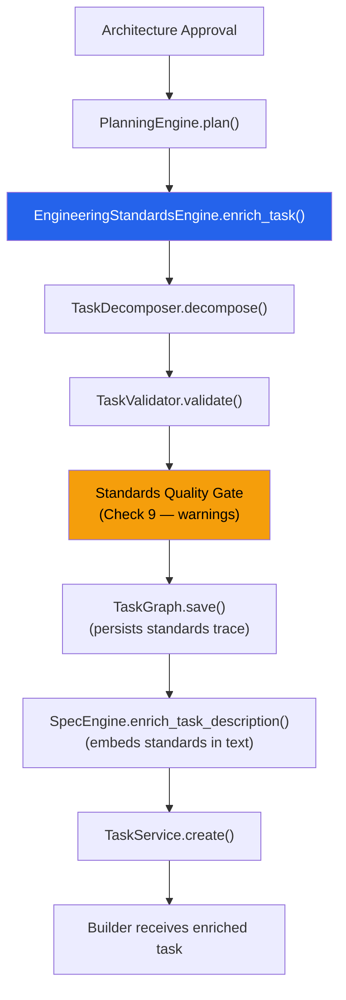

# Agent OS — Engineering Standards Engine v1.0

## Executive Summary

The **Engineering Standards Engine** is the central source of software engineering best practices across Agent OS. It ensures that every engineering task produced by the Planner contains enough technical guidance that any supported LLM can generate consistent, maintainable, secure, production-quality code.

Instead of relying on the intelligence of the model alone, Agent OS now supplies engineering standards as structured context. The Builder follows the standards. Future QA validates against the standards. Future Editing Mode preserves the standards.

---

## 1. Architecture



### Responsibilities

| Component | Responsibility |
|-----------|---------------|
| `EngineeringStandardsEngine` | Resolves profiles, enriches tasks with standards, validates quality |
| `PlanningEngine` | Calls `enrich_task()` on every coarse task during planning |
| `SpecEngine` | Embeds standards text block into task descriptions |
| `TaskValidator` | Warns on missing standards (Check 9) |
| `TaskGraph` | Persists standards metadata in planning trace |

---

## 2. Standard Categories (13 Domains)

Every engineering task can receive standards from up to 13 engineering domains:

| Domain | Description | Frontend | Backend |
|--------|-------------|----------|---------|
| `coding` | Language patterns, naming, component architecture | ✅ | ✅ |
| `folder_structure` | File organization and directory conventions | ✅ | ✅ |
| `testing` | Expected test coverage and verification criteria | ✅ | ✅ |
| `accessibility` | ARIA, keyboard navigation, color contrast | ✅ | — |
| `security` | Input validation, secrets management, output sanitization | ✅ | ✅ |
| `performance` | Rendering optimization, lazy loading, query efficiency | ✅ | ✅ |
| `documentation` | Code comments, docstrings, API docs | ✅ | ✅ |
| `styling` | CSS methodology, responsive design, theme tokens | ✅ | — |
| `api` | REST conventions, HTTP methods, response shapes | — | ✅ |
| `database` | Models, migrations, indexing, transactions | — | ✅ |
| `authentication` | JWT, password hashing, protected routes | ✅ | ✅ |
| `deployment` | Build verification, meta tags, health checks | ✅ | ✅ |
| `configuration` | Environment variables, config management | ✅ | ✅ |

Not all domains apply to every task. The engine uses **layer-domain mapping** to filter standards to what's relevant for each task's layer (FE, BE, AUTH, INT, QA, OPS).

---

## 3. Task Enrichment Flow

When a task is enriched, the engine adds the following to `engineering_metadata`:

```json
{
  "layer": "FE",
  "estimated_files_count": 2,
  "risk_level": "Low",
  
  "engineering_standards": {
    "coding": ["Use functional components exclusively", "..."],
    "testing": ["Component renders without crashing", "..."],
    "accessibility": ["All interactive elements have ARIA labels", "..."],
    "security": ["Never hardcode secrets", "..."],
    "performance": ["Avoid unnecessary re-renders", "..."]
  },
  "standards_profile": "react",
  "required_deliverables": ["src/components/Navbar.jsx", "src/components/Navbar.css"],
  "expected_files": {
    "create": ["src/components/Navbar.jsx", "src/components/Navbar.css"],
    "modify": [],
    "read": ["spec.json", "src/App.jsx"]
  },
  "testing_expectations": [
    "Component renders without errors",
    "Responsive layout verified at 375px, 768px, and 1024px"
  ],
  "security_expectations": [
    "No hardcoded secrets",
    "All user inputs validated before processing"
  ],
  "performance_expectations": [
    "No unnecessary re-renders",
    "Reuse components instead of duplicating markup"
  ],
  "documentation_expectations": [
    "Add JSDoc comment on component describing purpose and props"
  ]
}
```

Additionally, these standards are **embedded as readable text** into `task.description` via `SpecEngine.enrich_task_description()`, so the Builder receives them automatically without API changes.

---

## 4. Standard Profiles

### Current Profiles

| Profile | Technology | Domains Covered |
|---------|-----------|-----------------|
| `react` | React + Vite | coding, folder_structure, testing, accessibility, security, performance, documentation, styling, api, authentication, deployment, configuration |
| `fastapi` | FastAPI + Python | coding, folder_structure, testing, security, performance, documentation, api, database, authentication, deployment, configuration |

### Future Profiles (Framework Ready)

The architecture supports adding new profiles by simply adding a new entry to `_PROFILE_REGISTRY`:

```python
_PROFILE_REGISTRY = {
    "react": _REACT_PROFILE,
    "fastapi": _FASTAPI_PROFILE,
    # Future — add without modifying any other code:
    "nextjs": _NEXTJS_PROFILE,
    "vue": _VUE_PROFILE,
    "node": _NODE_PROFILE,
    "python_package": _PYTHON_PACKAGE_PROFILE,
    "flutter": _FLUTTER_PROFILE,
}
```

Or at runtime via the registration API:

```python
from app.services.engineering_standards import engineering_standards_engine

engineering_standards_engine.register_profile("nextjs", {
    "coding": ["Use App Router for all routes", "..."],
    "testing": ["..."],
    # ...
})
```

---

## 5. Extension Points

### Adding a New Domain

1. Add the domain name to `STANDARD_DOMAINS` list
2. Add rules for the domain in each relevant profile
3. Add the domain to the appropriate layers in `_LAYER_DOMAINS`

### Adding a New Profile

1. Define the profile as a `dict[str, list[str]]` mapping domains to rule lists
2. Add it to `_PROFILE_REGISTRY` or call `register_profile()` at runtime

### Adding a New Layer

1. Add the layer prefix to `_LAYER_DOMAINS` with its relevant domains
2. Update `PlanningEngine.plan()` keyword matching if needed

### Customizing Profile Resolution

Override `resolve_profiles()` or extend its logic to detect additional technologies from the project specification.

---

## 6. Quality Gate

The `TaskValidator` now includes **Check 9** — the Engineering Standards Gate:

| Check | Condition | Action |
|-------|-----------|--------|
| Missing `engineering_standards` | No standards attached | **Warning** |
| Missing `required_deliverables` | No deliverables defined | **Warning** |
| Missing `testing_expectations` | No testing guidance | **Warning** |
| Missing `security_expectations` | No security guidance | **Warning** |

> **Note**: This is a soft gate (warnings only) in v1.0. It does not reject tasks. Future iterations can harden this to rejections once all task types have full standards coverage.

The `EngineeringStandardsEngine` also provides `validate_enriched_task()` for standalone quality validation:

```python
issues = engineering_standards_engine.validate_enriched_task(task)
if issues:
    for issue in issues:
        print(f"Quality issue: {issue}")
```

---

## 7. Integration with Planner Pipeline

### Before (Initiative 1)
```
PlanningEngine.plan() → UIDs, Epics, Acceptance Criteria
```

### After (Initiative 2)
```
PlanningEngine.plan() → UIDs, Epics, Acceptance Criteria + Engineering Standards
```

The integration is minimal and non-disruptive:

1. **PlanningEngine** (`planning_engine.py`): Calls `engineering_standards_engine.enrich_task()` on each enriched task
2. **SpecEngine** (`spec_engine.py`): `enrich_task_description()` accepts optional `engineering_metadata` and embeds a standards text block
3. **main.py**: Passes `engineering_metadata` through to `enrich_task_description()`
4. **TaskValidator** (`task_validator.py`): Warns on missing standards (Check 9)
5. **TaskGraph** (`task_graph.py`): Persists standards profile and expectations in the planning trace

### Zero-Regression Guarantee

- **No API changes** — `engineering_metadata` is an existing `dict | None` field on all task schemas
- **No schema changes** — No new fields added to Pydantic models
- **No Builder changes** — Standards are embedded in `task.description` text that the Builder already reads
- **Backward compatible** — The new `engineering_metadata` parameter on `enrich_task_description()` defaults to `None`

---

## 8. Future Builder Integration

While Initiative 2 embeds standards as text in task descriptions, future Builder versions can consume the structured `engineering_metadata` directly:

```python
# Future Builder code
meta = task.engineering_metadata or {}
standards = meta.get("engineering_standards", {})
coding_rules = standards.get("coding", [])
testing_rules = meta.get("testing_expectations", [])

# Use structured standards to guide code generation
```

This enables:
- **Deterministic validation** against specific rules
- **Profile-aware code generation** (React patterns vs. Vue patterns)
- **Automated testing verification** against testing expectations
- **Security audit automation** against security expectations

---

## 9. Future QA Integration

The quality gate and structured standards enable future QA systems to:

1. **Validate generated code** against coding standards
2. **Verify deliverables** against `required_deliverables`
3. **Check file creation** against `expected_files`
4. **Run testing expectations** as acceptance criteria
5. **Audit security compliance** against security expectations
6. **Measure performance** against performance expectations

---

## 10. File Reference

| File | Role |
|------|------|
| `backend/app/services/engineering_standards.py` | Core engine — profiles, domains, enrichment, quality gate |
| `backend/app/services/planning_engine.py` | Integration — calls `enrich_task()` during planning |
| `backend/app/services/spec_engine.py` | Integration — embeds standards text in descriptions |
| `backend/app/services/task_validator.py` | Integration — Check 9 standards quality gate |
| `backend/app/services/task_graph.py` | Integration — persists standards in planning trace |
| `docs/engineering-standards-engine.md` | This documentation |
