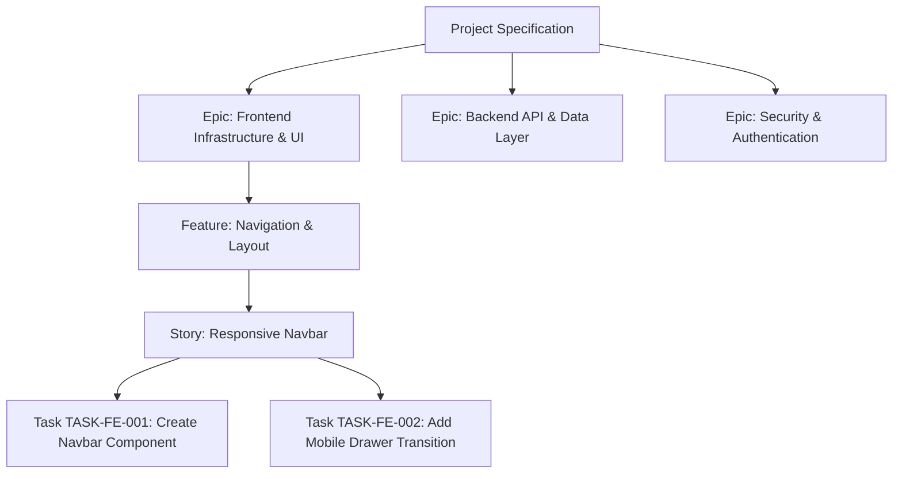

# Agent OS — Engineering Planning Engine v1.0

## Executive Summary

The **Engineering Planning Engine v1.0** transforms Agent OS's planning layer from a simple task generator into an architectural planning engine. Instead of outputting flat, coarse micro-tasks, the system now produces structured engineering work organized hierarchically into Epics, Features, Stories, and Atomic Engineering Tasks. Every task is assigned a stable unique identifier (UID), testable acceptance criteria, context dependencies, and complexity scores.

Crucially, this upgrade has been designed with strict **100% backward compatibility**. The downstream Builder and execution orchestrators continue operating without code changes, receiving rich acceptance criteria embedded directly into task descriptions.

---

## 1. Architectural Hierarchy Model

The planning pipeline organizes deliverables into a 4-tier hierarchy:



1. **Epic**: High-level domain division (e.g., *Frontend Infrastructure & UI*, *Backend API & Data Layer*, *Security & Authentication*).
2. **Feature**: Functional subsystem within an epic (e.g., *User Authentication*, *Core REST API*).
3. **Story**: User or developer value deliverable (e.g., *Implement Login Form*).
4. **Engineering Task**: Atomic work unit targeted at the Builder agent. Bound by the **Stop Condition**: *Each task must produce exactly one measurable result that can be independently verified.*

---

## 2. Engineering Task Schema & Metadata

Every task schema created by the planning engine adheres to the following structure:

| Field | Type | Description | Example |
| :--- | :--- | :--- | :--- |
| `task_uid` | `str` | Stable unique alphanumeric ID | `TASK-FE-001` |
| `epic` | `str` | Parent domain epic | `Frontend Infrastructure & UI` |
| `feature` | `str` | Parent subsystem | `Core User Interface` |
| `story` | `str` | Parent story deliverable | `Implement Build frontend shell` |
| `objective` | `str` | Concise engineering objective | `Objective: Create Hero Component` |
| `acceptance_criteria` | `list[str]` | Testable success conditions | `["Verify mobile responsive layout", "No console errors"]` |
| `complexity` | `str` | T-shirt sizing (`XS`, `S`, `M`, `L`, `XL`) | `S` |
| `estimated_context` | `list[str]` | Required files/context | `["spec.json", "src/App.jsx"]` |
| `context_dependencies` | `list[str]` | UIDs of prerequisite tasks | `["TASK-FE-001"]` |
| `engineering_metadata` | `dict` | Estimated files and risk level | `{"layer": "FE", "risk_level": "Low"}` |

---

## 3. Pipeline Flow & Backwards Compatibility

```
Architecture Approval (main.py)
       │
       ▼
PlanningEngine.plan() ──────► Assigns Epics, Features, UIDs, and baseline ACs
       │
       ▼
TaskDecomposer.decompose() ──► Expands into atomic tasks while inheriting hierarchy metadata
       │
       ▼
TaskValidator.validate() ────► Rejects cycles, duplicate UIDs, invalid complexity
       │
       ▼
TaskGraph.save() ────────────► Persists hierarchy map & complexity distribution
       │
       ▼
SpecEngine.enrich() ─────────► Embeds Acceptance Criteria block into task text description
       │
       ▼
TaskService.create() ────────► Passes TaskCreate schema to database
```

### Zero-Regression Guarantee
Because existing Builders ingest `task.title` and `task.description`, `SpecEngine.enrich_task_description()` automatically appends the formatted Acceptance Criteria and UID header directly into the text description. The Builder gains full testing guidelines without altering a single line of Builder code.

---

## 4. Validation Rules & Rejection Gating

The `TaskValidator` enforces quality standards before any task reaches the database:

- **Circular Dependency Guard**: Depth-First Search (DFS) cycle detection prevents infinite loops in execution graphs.
- **Duplicate UID Guard**: Enforces global uniqueness across `task_uid` identifiers.
- **Complexity Tier Check**: Validates that task complexity matches standard sizes (`XS`, `S`, `M`, `L`, `XL`).
- **Multi-Objective Warning**: Flags tasks joining disparate actions with "and" to encourage granular decomposition.
- **Missing Metadata Warnings**: Warns if acceptance criteria or expected outputs are omitted.
