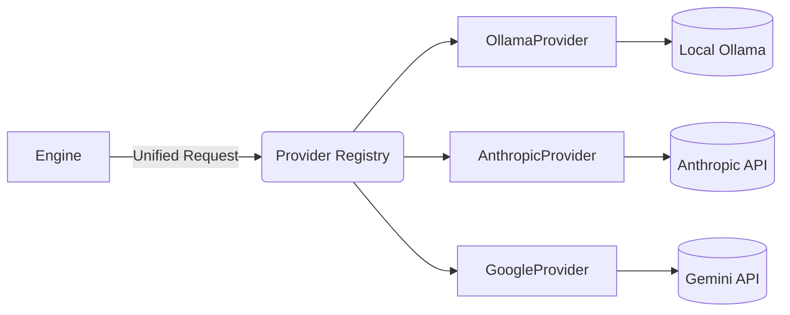

# Provider Layer Design

## 1. Problem Statement
Currently, Agent OS directly imports requests to an Ollama endpoint (`llm_service.py`), tying the entire platform's intelligence directly to a single local runner. As Agent OS scales to support models like Claude 3.5, Gemini 1.5, and OpenAI GPT-4o, hardcoding provider-specific APIs creates massive technical debt.

## 2. The Solution: Provider Abstraction Layer
The **Provider Layer** isolates the core logic of Agent OS from the specifics of any underlying LLM service. Engines request capabilities (e.g., "Complete this chat" or "Parse this structured output"), and the Provider Layer routes that request to the configured backend (Ollama, Anthropic, Google, etc.).

## 3. Core Capabilities (The Interface)
The `LLMProvider` interface will standardize the following capabilities:

### 3.1 Chat Completion
Standard text-in, text-out generation using a unified message format (`role`, `content`).
```python
def chat_completion(self, messages: list[Message], model: str, **kwargs) -> ChatResponse:
    pass
```

### 3.2 Streaming
Yielding chunks of text for real-time UI updates (used heavily by the Builder).
```python
def stream_completion(self, messages: list[Message], model: str, **kwargs) -> Iterator[str]:
    pass
```

### 3.3 Structured Output
Enforcing a JSON schema return type (critical for Planner and Intelligence engines).
```python
def structured_completion(self, messages: list[Message], schema: type[BaseModel], model: str) -> BaseModel:
    pass
```

### 3.4 Future Capabilities
- **Embeddings:** Vector generation for RAG and codebase context.
- **Vision:** Multi-modal analysis for visual QA of built UIs.
- **Tool Calling:** Native function calling standardization.

## 4. Provider Registry
A registry pattern will allow dynamic switching of models at runtime. The user's settings will dictate which provider handles the request.



## 5. Migration Strategy
1. **Define the Abstraction:** Create `backend/app/core/provider.py` defining the `LLMProvider` abstract base class.
2. **Implement Legacy Provider:** Wrap the existing `llm_service.py` logic into an `OllamaProvider` class that implements the new interface.
3. **Migrate Engines:** Slowly transition engines (starting with `ArchitectService`) to request the generic `LLMProvider` from a dependency injection container rather than importing `generate_response` directly.
