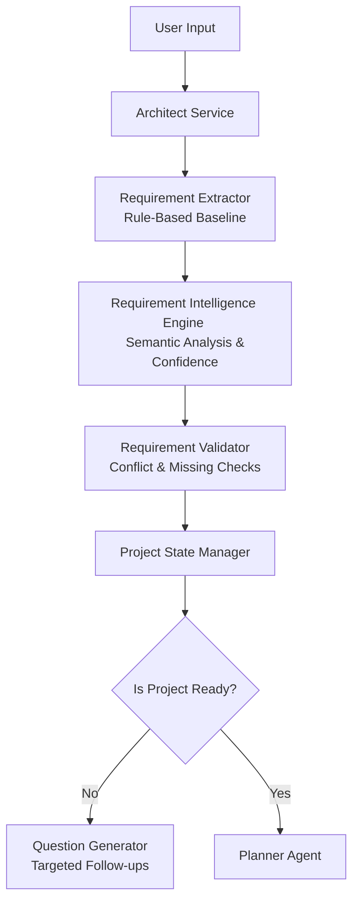

# Requirement Intelligence Engine

> [!NOTE]
> This document outlines the architecture, responsibilities, and logic flow of the Requirement Intelligence Engine (RIE), transforming the existing rule-based extraction into a robust intent-understanding subsystem.

## 1. Overview
The current system relies entirely on brittle keyword extraction (`RequirementExtractor`). The Requirement Intelligence Engine (RIE) introduces an LLM-assisted semantic understanding layer that executes *after* the rule-based extractor, but *before* validation and planning. 

The RIE is responsible for:
- **Intent Understanding**: Translating user intent ("sell online") into engineering concepts ("E-commerce", "PostgreSQL", "Stripe").
- **Evidence Collection**: Tracing every engineering decision back to a specific quote from the user.
- **Confidence Estimation**: Assigning statistical confidence to extracted fields.
- **Ambiguity Detection**: Identifying areas where the user's intent is unclear.
- **Conversation Memory**: Remembering context across clarification rounds so the Architect never repeats questions.

## 2. Pipeline Architecture

## 3. Core Responsibilities

### 3.1 Intent Detection
The RIE will use semantic analysis to group signals. Instead of single keyword matches, it evaluates the holistic prompt. 
- *Signal 1:* "users log in"
- *Signal 2:* "pay for subscription"
- *Signal 3:* "access dashboard"
-> *Intent:* SaaS Web Application, Authentication Required, Payment Gateway Required, Database Required.

### 3.2 Confidence Estimation Model
Confidence ($C$) is calculated based on:
1. **Explicit mention** ($C > 0.90$): The user explicitly stated the requirement.
2. **Strong inference** ($C \approx 0.70 - 0.89$): The requirement is strongly implied by the project type.
3. **Weak inference** ($C < 0.70$): A guess based on defaults.

> [!CAUTION]
> If a critical field's confidence drops below `0.70`, the system MUST NOT expose it as fact to the user. It must flag the field for clarification.

### 3.3 Evidence Tracking
For every field, the RIE extracts the exact string from the conversation that justified the classification. This evidence is attached to the `RequirementObject` and used in subsequent prompts to prevent LLM hallucinations.

### 3.4 Conversation Memory
The RIE maintains a strict semantic map of what has already been answered. If the user stated "I want a React app" in turn 1, and in turn 3 the system asks "Do you need a database?", the RIE ensures the frontend stack remains locked with high confidence and is excluded from the targeted question list.

## 4. Input / Output Contracts

### Input
- `raw_message`: The user's latest message.
- `conversation_history`: Transcript of the current session.
- `rule_based_state`: The flat dictionary currently extracted by `RequirementExtractor`.

### Output
- `IntelligentRequirementObject`: The rich, structured model defined in `requirement-object-specification.md`.

## 5. Extension Points (Extensibility)
The architecture is designed with interfaces for future enhancement:
- `BaseClassifier`: Interface for plugging in custom company-specific classifiers.
- `IndustryPackRegistry`: Hooks to load specialized intent rules (e.g., Healthcare HIPAA requirements).
- `LLMExtractor`: Abstracted LLM wrapper for swapping models (e.g., GPT-4o vs Claude 3.5).
