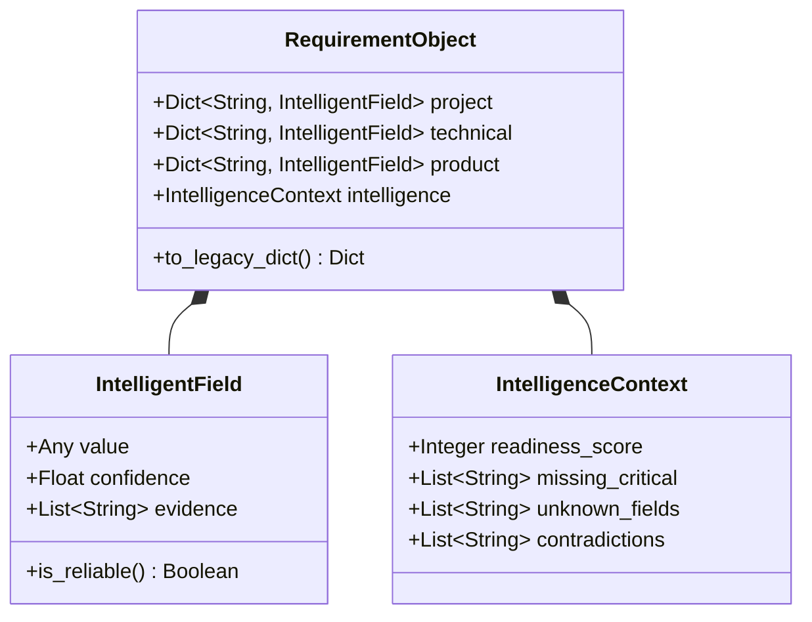

# Requirement Object Specification

> [!NOTE]
> This document specifies the structured requirement model designed for the Requirement Intelligence Engine. This object enriches and extends the existing state model without breaking backward compatibility.

## 1. Overview
The new Requirement Object serves as a comprehensive, intelligent record of what the user wants to build. Unlike the current system, which relies on a flat dictionary of keywords, the new Requirement Object models not only the data but the *quality* of that data (confidence, evidence, conflicts).

## 2. Model Structure

The object will be defined as a Pydantic schema or TypedDict, extending the existing `ProjectState` structure.

```json
{
  "project": {
    "name": { "value": "FlowDesk AI", "confidence": 0.95, "evidence": ["called FlowDesk AI"] },
    "type": { "value": "Web Application", "confidence": 0.98, "evidence": ["SaaS application"] },
    "domain": { "value": "Management", "confidence": 0.90, "evidence": ["project management platform"] },
    "industry": { "value": "B2B Software", "confidence": 0.85, "evidence": ["helps teams"] }
  },
  "technical": {
    "platform": { "value": "Web", "confidence": 0.99, "evidence": ["SaaS"] },
    "frontend_stack": { "value": "React + Vite", "confidence": 0.70, "evidence": ["implicit default"] },
    "backend_stack": { "value": "FastAPI", "confidence": 0.90, "evidence": ["Need Python backend"] },
    "database": { "value": "PostgreSQL", "confidence": 0.80, "evidence": ["structured data"] },
    "deployment": { "value": null, "confidence": 0.0, "evidence": [] }
  },
  "product": {
    "target_users": { "value": "Internal Teams", "confidence": 0.95, "evidence": ["helps teams manage"] },
    "business_goal": { "value": "Productivity", "confidence": 0.85, "evidence": ["manage projects, tasks"] },
    "core_features": [
      { "value": "Task Management", "confidence": 0.98, "evidence": ["manage projects, tasks"] },
      { "value": "Document Storage", "confidence": 0.95, "evidence": ["documents"] },
      { "value": "AI Workflows", "confidence": 0.95, "evidence": ["AI-assisted workflows"] }
    ],
    "constraints": []
  },
  "intelligence": {
    "readiness_score": 82,
    "missing_critical": ["deployment"],
    "unknown_fields": ["authentication_provider", "styling_preference"],
    "contradictions": []
  }
}
```

## 3. Core Components

### 3.1 Field-Level Metadata
Every extracted field must contain:
- **`value`**: The resolved value (e.g., "Web Application").
- **`confidence`**: A float from `0.0` to `1.0`.
- **`evidence`**: A list of string excerpts from the user's prompt or conversation history that justify the value.

### 3.2 Global Intelligence Context
- **`readiness_score`**: An integer (0-100) representing how ready this requirement set is for the Planner.
- **`missing_critical`**: A prioritized list of missing fields that block development (e.g., database, backend).
- **`unknown_fields`**: Non-critical fields that remain ambiguous.
- **`contradictions`**: A list of detected conflicts (e.g., `["Frontend only requested, but database specified."]`).

## 4. Backward Compatibility Strategy

To avoid breaking the current `ArchitectService`, `ProjectStateManager`, or `PlannerAgent`:
1. The `RequirementExtractor` will continue to return flat dictionaries (e.g., `{"project_type": "Web Application"}`).
2. The `Requirement Intelligence Engine` will map the rich `RequirementObject` *back* to the flat structure for legacy systems, while storing the rich object in a new top-level state key (e.g., `state["intelligence_profile"]`).
3. Future systems (Planner v2.0) can opt-in to reading `state["intelligence_profile"]`, while current systems continue reading `state["project_type"]`.

## 5. UML Class Diagram


