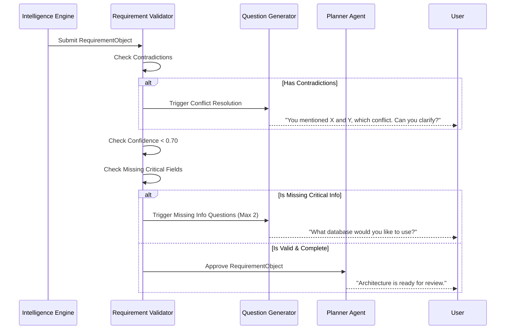

# Requirement Validation Design

> [!NOTE]
> This document specifies the Requirement Validator, a strict quality gate that prevents impossible, incomplete, or contradictory requirements from ever reaching the Planner.

## 1. Overview
Currently, the Planner attempts to build whatever the `RequirementExtractor` outputs, even if it logically makes no sense (e.g., a "Database without a Backend"). The Requirement Validator acts as an architectural firewall. It rejects invalid configurations and triggers the Question Generator to ask the user targeted clarification questions.

## 2. Validation Layers

### 2.1 Contradiction Detection
The validator analyzes the `RequirementObject` for conflicting signals.

**Examples of Conflicts:**
- *Stack Conflict:* "Frontend only" requested, but "Need PostgreSQL database" is also requested.
- *Auth Conflict:* "No authentication" requested, but "Google Login feature" is present in `core_features`.
- *Type Conflict:* "Static landing page" requested, but "Real-time Chat" feature is required.

**Action:** If a contradiction is detected, the `readiness_score` is dropped to 0, and the specific conflict is appended to the `contradictions` list for immediate clarification.

### 2.2 Essential Missing Information
Not all fields are equally important. The validator classifies missing information into priority tiers:
- **CRITICAL**: Cannot proceed to planning. (e.g., `project_type`, `database` (if backend exists), `authentication` state).
- **HIGH**: Should clarify if possible, but safe defaults exist. (e.g., `deployment`, `target_users`).
- **MEDIUM/LOW**: Can be safely inferred or ignored. (e.g., `theme`, styling preferences).

### 2.3 Impossible / Unsupported Combinations
The validator ensures the requested stack is supported by the Engineering Standards Engine.
- *Example:* "I want a WordPress backend with a React frontend." -> If WordPress is not in the `_BACKEND_PATTERNS` or Engineering Profiles, the validator rejects the requirement and suggests supported alternatives (e.g., "We currently support FastAPI, Node, etc.").

### 2.4 Low Confidence Rejection
If the RIE assigns a confidence `< 0.70` to a **CRITICAL** field, the validator strips the value and marks it as missing, forcing the system to explicitly ask the user rather than proceeding on a weak guess.

## 3. Question Generation Strategy

When the Validator rejects a state or flags missing fields, it hands off to the **Question Generator**.

### 3.1 Principles
1. **Minimalism**: Ask no more than 1-2 questions per conversation turn.
2. **Prioritization**: Always ask about Contradictions first. Then Critical missing fields. Then High priority missing fields.
3. **Context-Aware**: Use the `evidence` gathered to frame the question intelligently.
   - *Bad:* "Do you want a backend?"
   - *Good:* "You mentioned a PostgreSQL database. To support that, we'll need a backend API. Should we use Python (FastAPI) or Node.js?"
4. **Non-Repetitive**: Cross-reference the `conversation_history` to ensure a question is never asked twice.

## 4. Validation Flow Diagram

